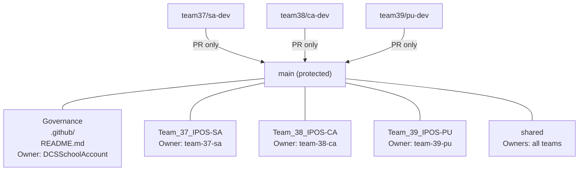

# Repository Governance and Ownership Model

## Purpose

This document defines the **governance structure, ownership boundaries, and contribution controls**
for the IPOS Group Project repository.

The goal of this governance model is to:
- Clearly separate subsystem responsibilities
- Prevent accidental cross-team changes
- Enforce review and accountability via GitHub mechanisms
- Support controlled cross-subsystem integration

The repository is public to enable governance features (CODEOWNERS and branch protection)
available on GitHub Free.

---

## Governance Principles

1. **Single stable integration branch**
   - The `main` branch represents the integrated, demo-ready system.
   - Direct pushes to `main` are not allowed.

2. **Subsystem ownership**
   - Each subsystem folder is owned by a dedicated team.
   - Ownership is enforced using CODEOWNERS.

3. **Maintainer-controlled governance**
   - Repository-wide governance files are owned by the project maintainer.
   - This avoids deadlock and ensures consistency.

4. **Explicit cross-team review**
   - Changes affecting multiple subsystems require explicit approval
     from all affected owners.

---

## Branch Model Overview

- `main`
  - Protected branch
  - Pull Requests required
  - Approvals required
  - Code Owner review required

- Subsystem development branches
  - `team37/sa-dev` – IPOS-SA (Team 37)
  - `team38/ca-dev` – IPOS-CA (Team 38)
  - `team39/pu-dev` – IPOS-PU (Team 39)

Subsystem branches are used for day-to-day development.
All integration into `main` happens via Pull Requests.

---

## Ownership and Approval Model (CODEOWNERS)

### Maintainer-owned (governance)

- `.github/`
- `README.md`

Owner:
- `@DCSSchoolAccount`

Any change to repository governance or contribution rules
requires explicit approval from the maintainer.

---

### Subsystem-owned folders

- `/Team_37_IPOS-SA/`
  - Owner: `@ipos-Group-17/team-37-sa`

- `/Team_38_IPOS-CA/`
  - Owner: `@ipos-Group-17/team-38-ca`

- `/Team_39_IPOS-PU/`
  - Owner: `@ipos-Group-17/team-39-pu`

Changes within a subsystem folder require approval
from the owning team.

---

### Shared resources

- `/shared/`

Owners:
- `@ipos-Group-17/team-37-sa`
- `@ipos-Group-17/team-38-ca`
- `@ipos-Group-17/team-39-pu`

The shared folder contains:
- Interface definitions
- Shared schemas
- Integration documentation

Any change to shared resources requires cross-team review.

---

## Governance Diagram

---

## Operational Rules Summary

- No direct pushes to `main`
- All changes go through Pull Requests
- CODEOWNERS determine required reviewers
- Self-approval is not permitted
- Governance changes are maintainer-controlled

---

## Notes on Early Solo Development

During early project stages, some teams may have only one member.
In such cases:
- CODEOWNERS enforcement may temporarily block self-approval
- This is expected behaviour
- Any temporary relaxation of rules should be deliberate,
  minimal, and re-enabled once additional members join

---

## Change Policy

This governance model should not be modified without agreement
from all subsystem teams and the project maintainer.

